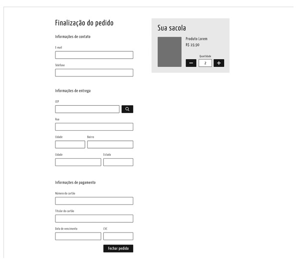
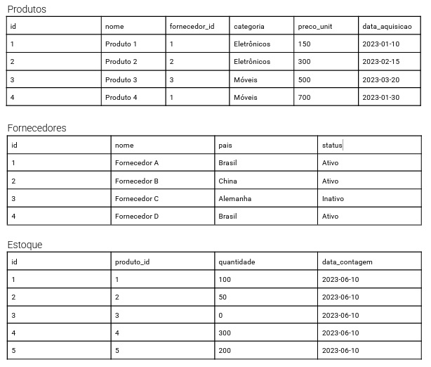

# 💼 Catálogo de Produtos

## 🚀 Teste Técnico - Full Stack

### ✅ Requisitos do Desafio

1. As respostas devem ser documentadas em um repositório Git (público ou privado, com acesso concedido ao avaliador)
2. As soluções devem seguir boas práticas de programação, versionamento e organização de código
3. A documentação (README.md) deve conter instruções claras sobre como rodar o projeto e justificar decisões técnicas
4. O teste pode ser realizado em um único projeto, mas cada exercício deve estar claramente identificado

#### 🎨 5. Orientações para Front-End

- **a - Paleta de Cores e Fontes:** Pode escolher qualquer paleta de cores e fontes;
- **b - Conteúdo Visual:** Pode utilizar imagens do site da Uma Penca ou da Chico Rei
- **c - Dados de Exemplo:** Sugerimos que use o fakerjs (https://github.com/faker-js/faker) pra preencher o conteúdo das páginas (os dados de exemplo);
- **d - Estilização:** Pode utilizar estilos prontos (Bootstrap e afins), mas deve-se personalizar alguma coisa estilizando com LESS (pode ser tamanhos, fontes, cores, espaçamentos, etc.).
- **e - Avaliação:** Além do código limpo e organizado também será avaliado a documentação, princípios de acessibilidade, otimização e criatividade.

---

### 📚 Exercícios a Realizar

#### 1️⃣ **Vue.js - Ciclo de Vida**

Explique como funciona o ciclo de vida de um componente em Vue.js e como isso influencia na performance de uma aplicação.

#### 2️⃣ **Laravel + Vue.js - Autenticação**

Em aplicações Laravel + Vue.js, qual é a melhor abordagem para lidar com autenticação entre o frontend e o backend? Explique um fluxo seguro para login, armazenando tokens e a comunicação entre as camadas.

#### 3️⃣ **APIs - Performance**

Um endpoint da API está demorando muito para responder. Quais técnicas você usaria para identificar e resolver esse problema no backend?

#### 4️⃣ **Integrações - CDN**

Como a utilização de CDN melhora a performance de uma aplicação web.

#### 5️⃣ **Engenharia de Software e Banco de Dados - Cache em Memória**

Em uma aplicação Laravel utilizando MySQL (RDS), por que seria interessante usar Memcached ou ElasticCache? Como essas tecnologias ajudam na escalabilidade?

#### 6️⃣ **Engenharia de Software e Banco de Dados - Eloquent ORM**

O que acha de algo como: Quais as vantagens e desvantagens em utilizar o Eloquent do Laravel? Existe algum possível problema recorrente (N+1 queries)?

#### 7️⃣ **Engenharia de Software e Banco de Dados - Filas Assíncronas**

Explique como implementar um sistema de filas assíncronas no Laravel. Para que tipo de funcionalidades essa abordagem é útil?

#### 8️⃣ **Engenharia de Software e Banco de Dados - Transactions**

Quando é interessante utilizar transactions?

#### 9️⃣ **Análise de Log**

O que você entende do log abaixo?

```log
[2018-05-16 01:07:31] production.ERROR: Call to a member function getImage() on null
{
    "exception": "[object] (Symfony\\Component\\Debug\\Exception\\FatalThrowableError(code: 0): Call to a member function getImage() on null at /admin/app/Models/Imagem.php:147)",
    "stacktrace": [
        "#0 /admin/vendor/laravel/framework/src/Illuminate/Cache/Repository.php(362): UmaPenca\\Models\\Imagem->UmaPenca\\Models\\{closure}()",
        "#1 /admin/app/Models/Imagem.php(157): Illuminate\\Cache\\Repository->rememberForever('products_667_im...', Object(Closure))",
        "#2 /admin/app/Transformers/ImagemTransformer.php(25): UmaPenca\\Models\\Imagem->getThumbs()",
        "#3 /admin/vendor/league/fractal/src/Scope.php(338): UmaPenca\\Transformers\\ImagemTransformer->transform(Object(UmaPenca\\Models\\Imagem))",
        "#4 /admin/vendor/league/fractal/src/Scope.php(278): League\\Fractal\\Scope->fireTransformer(Object(UmaPenca\\Transformers\\ImagemTransformer), Object(UmaPenca\\Models\\Imagem))",
        "#5 /admin/vendor/league/fractal/src/Scope.php(208): League\\Fractal\\Scope->executeResourceTransformers()",
        "#6 /admin/vendor/league/fractal/src/TransformerAbstract.php(151): League\\Fractal\\Scope->toArray()",
        "#7 /admin/vendor/league/fractal/src/TransformerAbstract.php(123): League\\Fractal\\TransformerAbstract->includeResourceIfAvailable(Object(League\\Fractal\\Scope), Object(UmaPenca\\Models\\Produto), Array, 'capa')",
        "#8 /admin/vendor/league/fractal/src/Scope.php(363): League\\Fractal\\TransformerAbstract->processIncludedResources(Object(League\\Fractal\\Scope), Object(UmaPenca\\Models\\Produto))",
        "#9 /admin/vendor/league/fractal/src/Scope.php(342): League\\Fractal\\Scope->fireIncludedTransformers(Object(UmaPenca\\Transformers\\ProdutoTransformer), Object(UmaPenca\\Models\\Produto))",
        "#10 /admin/vendor/league/fractal/src/Scope.php(278): League\\Fractal\\Scope->fireTransformer(Object(UmaPenca\\Transformers\\ProdutoTransformer), Object(UmaPenca\\Models\\Produto))",
        "#11 /admin/vendor/league/fractal/src/Scope.php(208): League\\Fractal\\Scope->executeResourceTransformers()",
        "#12 /admin/app/Factories/ResponseFactory.php(209): League\\Fractal\\Scope->toArray()",
        "#13 /admin/app/Factories/ResponseFactory.php(77): UmaPenca\\Factories\\ResponseFactory->handleItem(Object(UmaPenca\\Models\\Produto), Object(UmaPenca\\Transformers\\ProdutoTransformer))",
        "#14 /admin/app/Http/Controllers/Api/ProdutoController.php(181): UmaPenca\\Factories\\ResponseFactory->create(Object(UmaPenca\\Models\\Produto))",
        "#15 /admin/vendor/laravel/framework/src/Illuminate/Cache/Repository.php(362): UmaPenca\\Http\\Controllers\\Api\\ProdutoController->UmaPenca\\Http\\Controllers\\Api\\{closure}()",
        "#16 /admin/app/Http/Controllers/Api/ProdutoController.php(182): Illuminate\\Cache\\Repository->rememberForever('products_667_in...', Object(Closure))",
        "#17 [internal function]: UmaPenca\\Http\\Controllers\\Api\\ProdutoController->info(Object(UmaPenca\\Models\\Produto))",
        "#18 /admin/vendor/laravel/framework/src/Illuminate/Routing/Controller.php(54): call_user_func_array(Array, Array)",
        "#19 /admin/vendor/laravel/framework/src/Illuminate/Routing/ControllerDispatcher.php(45): Illuminate\\Routing\\Controller->callAction('info', Array)",
        "#20 /admin/vendor/laravel/framework/src/Illuminate/Routing/Route.php(212): Illuminate\\Routing\\ControllerDispatcher->dispatch(Object(Illuminate\\Routing\\Route), Object(UmaPenca\\Http\\Controllers\\Api\\ProdutoController), 'info')",
        "#21 /admin/vendor/laravel/framework/src/Illuminate/Routing/Route.php(169): Illuminate\\Routing\\Route->runController()",
        "#22 /admin/vendor/laravel/framework/src/Illuminate/Routing/Router.php(659): Illuminate\\Routing\\Route->run()",
        "#23 /admin/vendor/laravel/framework/src/Illuminate/Routing/Pipeline.php(30): Illuminate\\Routing\\Router->Illuminate\\Routing\\{closure}(Object(Illuminate\\Http\\Request))",
        "#24 /admin/vendor/barryvdh/laravel-cors/src/HandleCors.php(36): Illuminate\\Routing\\Pipeline->Illuminate\\Routing\\{closure}(Object(Illuminate\\Http\\Request))",
        "#25 /admin/vendor/laravel/framework/src/Illuminate/Pipeline/Pipeline.php(149): Barryvdh\\Cors\\HandleCors->handle(Object(Illuminate\\Http\\Request), Object(Closure))",
        "#26 /admin/vendor/laravel/framework/src/Illuminate/Routing/Pipeline.php(53): Illuminate\\Pipeline\\Pipeline->Illuminate\\Pipeline\\{closure}(Object(Illuminate\\Http\\Request))",
        "#27 /admin/vendor/laravel/framework/src/Illuminate/Routing/Middleware/SubstituteBindings.php(41): Illuminate\\Routing\\Pipeline->Illuminate\\Routing\\{closure}(Object(Illuminate\\Http\\Request))",
        "#28 /admin/vendor/laravel/framework/src/Illuminate/Pipeline/Pipeline.php(149): Illuminate\\Routing\\Middleware\\SubstituteBindings->handle(Object(Illuminate\\Http\\Request), Object(Closure))",
        "#29 /admin/vendor/laravel/framework/src/Illuminate/Routing/Pipeline.php(53): Illuminate\\Pipeline\\Pipeline->Illuminate\\Pipeline\\{closure}(Object(Illuminate\\Http\\Request))",
        "#30 /admin/app/Http/Middleware/AuthenticateApi.php(57): Illuminate\\Routing\\Pipeline->Illuminate\\Routing\\{closure}(Object(Illuminate\\Http\\Request))",
        "#31 /admin/vendor/laravel/framework/src/Illuminate/Pipeline/Pipeline.php(149): UmaPenca\\Http\\Middleware\\AuthenticateApi->handle(Object(Illuminate\\Http\\Request), Object(Closure))",
        "#32 /admin/vendor/laravel/framework/src/Illuminate/Routing/Pipeline.php(53): Illuminate\\Pipeline\\Pipeline->Illuminate\\Pipeline\\{closure}(Object(Illuminate\\Http\\Request))",
        "#33 /admin/vendor/laravel/framework/src/Illuminate/Pipeline/Pipeline.php(102): Illuminate\\Routing\\Pipeline->Illuminate\\Routing\\{closure}(Object(Illuminate\\Http\\Request))",
        "#34 /admin/vendor/laravel/framework/src/Illuminate/Routing/Router.php(661): Illuminate\\Pipeline\\Pipeline->then(Object(Closure))",
        "#35 /admin/vendor/laravel/framework/src/Illuminate/Routing/Router.php(636): Illuminate\\Routing\\Router->runRouteWithinStack(Object(Illuminate\\Routing\\Route), Object(Illuminate\\Http\\Request))",
        "#36 /admin/vendor/laravel/framework/src/Illuminate/Routing/Router.php(602): Illuminate\\Routing\\Router->runRoute(Object(Illuminate\\Http\\Request), Object(Illuminate\\Routing\\Route))",
        "#37 /admin/vendor/laravel/framework/src/Illuminate/Routing/Router.php(591): Illuminate\\Routing\\Router->dispatchToRoute(Object(Illuminate\\Http\\Request))",
        "#38 /admin/vendor/laravel/framework/src/Illuminate/Foundation/Http/Kernel.php(176): Illuminate\\Routing\\Router->dispatch(Object(Illuminate\\Http\\Request))",
        "#39 /admin/vendor/laravel/framework/src/Illuminate/Routing/Pipeline.php(30): Illuminate\\Foundation\\Http\\Kernel->Illuminate\\Foundation\\Http\\{closure}(Object(Illuminate\\Http\\Request))",
        "#40 /admin/app/Http/Middleware/Localize.php(38): Illuminate\\Routing\\Pipeline->Illuminate\\Routing\\{closure}(Object(Illuminate\\Http\\Request))",
        "#41 /admin/vendor/laravel/framework/src/Illuminate/Pipeline/Pipeline.php(149): UmaPenca\\Http\\Middleware\\Localize->handle(Object(Illuminate\\Http\\Request), Object(Closure))",
        "#42 /admin/vendor/laravel/framework/src/Illuminate/Routing/Pipeline.php(53): Illuminate\\Pipeline\\Pipeline->Illuminate\\Pipeline\\{closure}(Object(Illuminate\\Http\\Request))",
        "#43 /admin/vendor/laravel/framework/src/Illuminate/Foundation/Http/Middleware/CheckForMaintenanceMode.php(46): Illuminate\\Routing\\Pipeline->Illuminate\\Routing\\{closure}(Object(Illuminate\\Http\\Request))",
        "#44 /admin/vendor/laravel/framework/src/Illuminate/Pipeline/Pipeline.php(149): Illuminate\\Foundation\\Http\\Middleware\\CheckForMaintenanceMode->handle(Object(Illuminate\\Http\\Request), Object(Closure))",
        "#45 /admin/vendor/laravel/framework/src/Illuminate/Routing/Pipeline.php(53): Illuminate\\Pipeline\\Pipeline->Illuminate\\Pipeline\\{closure}(Object(Illuminate\\Http\\Request))",
        "#46 /admin/vendor/barryvdh/laravel-cors/src/HandlePreflight.php(35): Illuminate\\Routing\\Pipeline->Illuminate\\Routing\\{closure}(Object(Illuminate\\Http\\Request))",
        "#47 /admin/vendor/laravel/framework/src/Illuminate/Pipeline/Pipeline.php(149): Barryvdh\\Cors\\HandlePreflight->handle(Object(Illuminate\\Http\\Request), Object(Closure))",
        "#48 /admin/vendor/laravel/framework/src/Illuminate/Routing/Pipeline.php(53): Illuminate\\Pipeline\\Pipeline->Illuminate\\Pipeline\\{closure}(Object(Illuminate\\Http\\Request))",
        "#49 /admin/vendor/laravel/framework/src/Illuminate/Pipeline/Pipeline.php(102): Illuminate\\Routing\\Pipeline->Illuminate\\Routing\\{closure}(Object(Illuminate\\Http\\Request))",
        "#50 /admin/vendor/laravel/framework/src/Illuminate/Foundation/Http/Kernel.php(151): Illuminate\\Pipeline\\Pipeline->then(Object(Closure))",
        "#51 /admin/vendor/laravel/framework/src/Illuminate/Foundation/Http/Kernel.php(116): Illuminate\\Foundation\\Http\\Kernel->sendRequestThroughRouter(Object(Illuminate\\Http\\Request))",
        "#52 /admin/public/index.php(53): Illuminate\\Foundation\\Http\\Kernel->handle(Object(Illuminate\\Http\\Request))",
        "#53 {main}"
    ]
}
```

#### 🔟 **Desenvolvimento Full-Stack (Laravel + Vue.js) - CRUD de Produtos**

Crie um pequeno CRUD de produtos utilizando Laravel para o backend e Vue.js no frontend. A aplicação deve permitir criação, leitura, atualização e deleção (CRUD) de produtos.

**Cada produto deve conter:**

- Nome
- Descrição
- Preço
- Imagem

**Requisitos:**

**Backend em Laravel:**
Criar modelo, migration, controller e rotas REST para cada ação.

**Frontend em Vue.js:**
Criar interface para consumir a API e exibir os produtos.

**Autenticação:**
Apenas usuários autenticados podem modificar produtos.

#### 1️⃣1️⃣ **Critique o código abaixo e como poderia ser melhorado: **

```php
/**
 * @param InterfaceItemPedido $orderItem
 * @return array
 */
public function transform(InterfaceItemPedido $orderItem)
{
    return [
        'item_pedido_id' => $orderItem->getId(),
        'product_id'     => $orderItem->getProductId(),
        'quantity'       => $orderItem->getQuantity(),
        'price'          => $orderItem->getPrice(),
        'total_price'    => $orderItem->getTotalPrice(),
        'discount'       => $orderItem->getDiscount(),
        'product_name'   => $orderItem->getProduct()->getName(),
        'link_rewrite'   => $orderItem->getProduct()->getLinkRewrite(),
        'size_name'      => $orderItem->getSize()->getName(),
        'gender'         => $orderItem->getSize()->getGender(),
        'gender_name'    => $orderItem->getSize()->getLongGender(),
        'active'         => $orderItem->getProduct()->isActive(),
        'type'           => $orderItem->getProduct()->getType(),
    ];
}
```

#### 1️⃣2️⃣ **Front-End - Checkout**

Desenvolver uma página para a finalização de uma compra. Os produtos na sacola/carrinho serão hardcoded. Deve conter as seguintes funcionalidades:

- Validação de campos com formatos específicos (cartão de crédito, data, cep, e-mail, telefone, etc);
- Validação de campos vazios (considere que todos são obrigatórios);
- Alteração da quantidade dos produtos na sacola/carrinho;
- Carregamento do endereço a partir do CEP utilizando o cep-promise (https://github.com/BrasilAPI/cep-promise);
- Exibição de indicadores de carregamento enquanto a página realizar alguma requisição;
- Exibição de uma mensagem de sucesso ao fechar o pedido (considere sucesso quando todos os campos forem válidos);
- Ao fechar o pedido, deve-se exibir o objeto final no console (console.log).

Exemplo de layout:


#### 1️⃣3️⃣ **Experiência Profissional**

Descreva um projeto desafiador em que você trabalhou recentemente como desenvolvedor full-stack. Em sua resposta, inclua:

- **Contexto:** Qual era o propósito do projeto e quais eram seus objetivos?
- **Desafios:** Que desafios técnicos ou de gerenciamento de projetos você enfrentou?
- **Soluções:** Quais foram as soluções que você implementou para superar esses desafios? Como você utilizou tecnologias como Vue.js, Laravel, ou qualquer outra mencionada na descrição da vaga?
- **Impacto:** Quais foram os resultados do projeto em termos de desempenho da equipe, satisfação do cliente ou melhorias no produto?
- **Lições Aprendidas:** Que lições você tirou dessa experiência que poderia aplicar em projetos futuros?

#### 1️⃣4️⃣ **SQL - Análise de Vendas**

Utilizando a seguinte estrutura de tabelas no MySQL para um banco de dados de vendas:

```SQL
CREATE TABLE clientes ( id INT PRIMARY KEY, nome VARCHAR(100), email VARCHAR(100), estado VARCHAR(50) ); CREATE TABLE pedidos ( id INT PRIMARY KEY, cliente_id INT, data_pedido DATE, valor_total DECIMAL(10,2), FOREIGN KEY (cliente_id) REFERENCES clientes(id) );
```

Utilizando o Eloquent do Laravel: 

● Escreva uma query para listar os estados com o maior volume de vendas (soma de valor_total). 
● Escreva uma query para listar os 5 clientes que mais compraram (considerando valor_total). 
● Qual seria a melhor forma de otimizar a performance dessas consultas? 

#### 1️⃣5️⃣ **SQL - Análise de Produtos e Fornecedores**

Você trabalhará com um banco de dados relacional contendo informações sobre produtos, fornecedores e estoque. Seu objetivo é escrever queries SQL para obter insights a partir dessas tabelas, aplicando funções de agregação e filtragem de dados.  

Os dados fornecidos abaixo são fictícios e representam um cenário típico de telas internas.  

 

Utilizando o Eloquent do Laravel 

- Escreva uma query para identificar os produtos que possuem estoque abaixo da média geral  
- - Escreva uma query para identificar quais fornecedores possuem produtos cujo preço unitário é maior que a média dos preços dentro de sua categoria? Exiba o nome do fornecedor, nome do produto, categoria e o preço. (Para melhor análise, lembre de ordenar a tabela por categoria e preço unitário dos produtos.) 
- Escreva uma query para identificar quais são os produtos mais recentes, adquiridos de fornecedores do Brasil, e possuem estoque acima da média de todos os produtos. 
  
Entregável: 

- Escreva as queries em um arquivo .sql ou .txt e adicione qualquer explicação necessária. 
- Documente suas respostas e justifique suas escolhas (opcional, mas recomendado). 