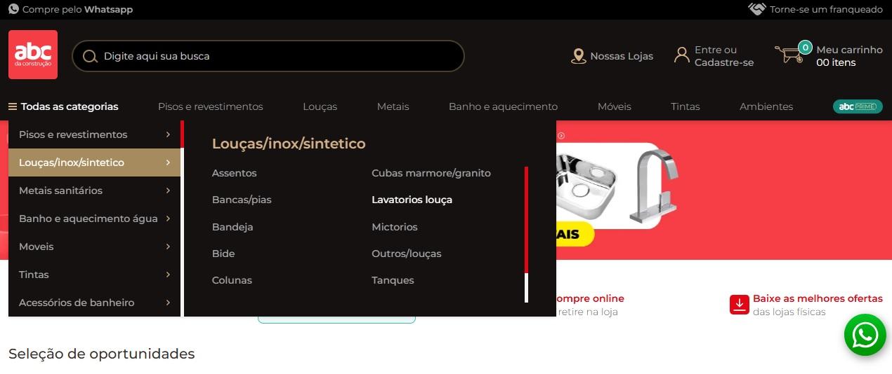

# 💼 Catálogo de Produtos

## 🎓 Exercícios 9, 11 e 13

### 📌 Exercício 9 - O que você entende do log abaixo?

#### 📌 Análise do Erro
O log apresenta um erro em ambiente de produção:

```log
[2018-05-16 01:07:31] production.ERROR: Call to a member function getImage() on null
{
    "exception": "[object] (Symfony\\Component\\Debug\\Exception\\FatalThrowableError(code: 0): Call to a member function getImage() on null at /admin/app/Models/Imagem.php:147)",
    "stacktrace": [
        "#0 /admin/vendor/laravel/framework/src/Illuminate/Cache/Repository.php(362): UmaPenca\\Models\\Imagem->UmaPenca\\Models\\{closure}()",
        "#1 /admin/app/Models/Imagem.php(157): Illuminate\\Cache\\Repository->rememberForever('products_667_im...', Object(Closure))",
        "#2 /admin/app/Transformers/ImagemTransformer.php(25): UmaPenca\\Models\\Imagem->getThumbs()",
        "#3 /admin/vendor/league/fractal/src/Scope.php(338): UmaPenca\\Transformers\\ImagemTransformer->transform(Object(UmaPenca\\Models\\Imagem))",
        "#4 /admin/vendor/league/fractal/src/Scope.php(278): League\\Fractal\\Scope->fireTransformer(Object(UmaPenca\\Transformers\\ImagemTransformer), Object(UmaPenca\\Models\\Imagem))",
        "#5 /admin/vendor/league/fractal/src/Scope.php(208): League\\Fractal\\Scope->executeResourceTransformers()",
        "#6 /admin/vendor/league/fractal/src/TransformerAbstract.php(151): League\\Fractal\\Scope->toArray()",
        "#7 /admin/vendor/league/fractal/src/TransformerAbstract.php(123): League\\Fractal\\TransformerAbstract->includeResourceIfAvailable(Object(League\\Fractal\\Scope), Object(UmaPenca\\Models\\Produto), Array, 'capa')",
        "#8 /admin/vendor/league/fractal/src/Scope.php(363): League\\Fractal\\TransformerAbstract->processIncludedResources(Object(League\\Fractal\\Scope), Object(UmaPenca\\Models\\Produto))",
        "#9 /admin/vendor/league/fractal/src/Scope.php(342): League\\Fractal\\Scope->fireIncludedTransformers(Object(UmaPenca\\Transformers\\ProdutoTransformer), Object(UmaPenca\\Models\\Produto))",
        "#10 /admin/vendor/league/fractal/src/Scope.php(278): League\\Fractal\\Scope->fireTransformer(Object(UmaPenca\\Transformers\\ProdutoTransformer), Object(UmaPenca\\Models\\Produto))",
        "#11 /admin/vendor/league/fractal/src/Scope.php(208): League\\Fractal\\Scope->executeResourceTransformers()",
        "#12 /admin/app/Factories/ResponseFactory.php(209): League\\Fractal\\Scope->toArray()",
        "#13 /admin/app/Factories/ResponseFactory.php(77): UmaPenca\\Factories\\ResponseFactory->handleItem(Object(UmaPenca\\Models\\Produto), Object(UmaPenca\\Transformers\\ProdutoTransformer))",
        "#14 /admin/app/Http/Controllers/Api/ProdutoController.php(181): UmaPenca\\Factories\\ResponseFactory->create(Object(UmaPenca\\Models\\Produto))",
        "#15 /admin/vendor/laravel/framework/src/Illuminate/Cache/Repository.php(362): UmaPenca\\Http\\Controllers\\Api\\ProdutoController->UmaPenca\\Http\\Controllers\\Api\\{closure}()",
        "#16 /admin/app/Http/Controllers/Api/ProdutoController.php(182): Illuminate\\Cache\\Repository->rememberForever('products_667_in...', Object(Closure))",
        "#17 [internal function]: UmaPenca\\Http\\Controllers\\Api\\ProdutoController->info(Object(UmaPenca\\Models\\Produto))",
        "#18 /admin/vendor/laravel/framework/src/Illuminate/Routing/Controller.php(54): call_user_func_array(Array, Array)",
        "#19 /admin/vendor/laravel/framework/src/Illuminate/Routing/ControllerDispatcher.php(45): Illuminate\\Routing\\Controller->callAction('info', Array)",
        "#20 /admin/vendor/laravel/framework/src/Illuminate/Routing/Route.php(212): Illuminate\\Routing\\ControllerDispatcher->dispatch(Object(Illuminate\\Routing\\Route), Object(UmaPenca\\Http\\Controllers\\Api\\ProdutoController), 'info')",
        "#21 /admin/vendor/laravel/framework/src/Illuminate/Routing/Route.php(169): Illuminate\\Routing\\Route->runController()",
        "#22 /admin/vendor/laravel/framework/src/Illuminate/Routing/Router.php(659): Illuminate\\Routing\\Route->run()",
        "#23 /admin/vendor/laravel/framework/src/Illuminate/Routing/Pipeline.php(30): Illuminate\\Routing\\Router->Illuminate\\Routing\\{closure}(Object(Illuminate\\Http\\Request))",
        "#24 /admin/vendor/barryvdh/laravel-cors/src/HandleCors.php(36): Illuminate\\Routing\\Pipeline->Illuminate\\Routing\\{closure}(Object(Illuminate\\Http\\Request))",
        "#25 /admin/vendor/laravel/framework/src/Illuminate/Pipeline/Pipeline.php(149): Barryvdh\\Cors\\HandleCors->handle(Object(Illuminate\\Http\\Request), Object(Closure))",
        "#26 /admin/vendor/laravel/framework/src/Illuminate/Routing/Pipeline.php(53): Illuminate\\Pipeline\\Pipeline->Illuminate\\Pipeline\\{closure}(Object(Illuminate\\Http\\Request))",
        "#27 /admin/vendor/laravel/framework/src/Illuminate/Routing/Middleware/SubstituteBindings.php(41): Illuminate\\Routing\\Pipeline->Illuminate\\Routing\\{closure}(Object(Illuminate\\Http\\Request))",
        "#28 /admin/vendor/laravel/framework/src/Illuminate/Pipeline/Pipeline.php(149): Illuminate\\Routing\\Middleware\\SubstituteBindings->handle(Object(Illuminate\\Http\\Request), Object(Closure))",
        "#29 /admin/vendor/laravel/framework/src/Illuminate/Routing/Pipeline.php(53): Illuminate\\Pipeline\\Pipeline->Illuminate\\Pipeline\\{closure}(Object(Illuminate\\Http\\Request))",
        "#30 /admin/app/Http/Middleware/AuthenticateApi.php(57): Illuminate\\Routing\\Pipeline->Illuminate\\Routing\\{closure}(Object(Illuminate\\Http\\Request))",
        "#31 /admin/vendor/laravel/framework/src/Illuminate/Pipeline/Pipeline.php(149): UmaPenca\\Http\\Middleware\\AuthenticateApi->handle(Object(Illuminate\\Http\\Request), Object(Closure))",
        "#32 /admin/vendor/laravel/framework/src/Illuminate/Routing/Pipeline.php(53): Illuminate\\Pipeline\\Pipeline->Illuminate\\Pipeline\\{closure}(Object(Illuminate\\Http\\Request))",
        "#33 /admin/vendor/laravel/framework/src/Illuminate/Pipeline/Pipeline.php(102): Illuminate\\Routing\\Pipeline->Illuminate\\Routing\\{closure}(Object(Illuminate\\Http\\Request))",
        "#34 /admin/vendor/laravel/framework/src/Illuminate/Routing/Router.php(661): Illuminate\\Pipeline\\Pipeline->then(Object(Closure))",
        "#35 /admin/vendor/laravel/framework/src/Illuminate/Routing/Router.php(636): Illuminate\\Routing\\Router->runRouteWithinStack(Object(Illuminate\\Routing\\Route), Object(Illuminate\\Http\\Request))",
        "#36 /admin/vendor/laravel/framework/src/Illuminate/Routing/Router.php(602): Illuminate\\Routing\\Router->runRoute(Object(Illuminate\\Http\\Request), Object(Illuminate\\Routing\\Route))",
        "#37 /admin/vendor/laravel/framework/src/Illuminate/Routing/Router.php(591): Illuminate\\Routing\\Router->dispatchToRoute(Object(Illuminate\\Http\\Request))",
        "#38 /admin/vendor/laravel/framework/src/Illuminate/Foundation/Http/Kernel.php(176): Illuminate\\Routing\\Router->dispatch(Object(Illuminate\\Http\\Request))",
        "#39 /admin/vendor/laravel/framework/src/Illuminate/Routing/Pipeline.php(30): Illuminate\\Foundation\\Http\\Kernel->Illuminate\\Foundation\\Http\\{closure}(Object(Illuminate\\Http\\Request))",
        "#40 /admin/app/Http/Middleware/Localize.php(38): Illuminate\\Routing\\Pipeline->Illuminate\\Routing\\{closure}(Object(Illuminate\\Http\\Request))",
        "#41 /admin/vendor/laravel/framework/src/Illuminate/Pipeline/Pipeline.php(149): UmaPenca\\Http\\Middleware\\Localize->handle(Object(Illuminate\\Http\\Request), Object(Closure))",
        "#42 /admin/vendor/laravel/framework/src/Illuminate/Routing/Pipeline.php(53): Illuminate\\Pipeline\\Pipeline->Illuminate\\Pipeline\\{closure}(Object(Illuminate\\Http\\Request))",
        "#43 /admin/vendor/laravel/framework/src/Illuminate/Foundation/Http/Middleware/CheckForMaintenanceMode.php(46): Illuminate\\Routing\\Pipeline->Illuminate\\Routing\\{closure}(Object(Illuminate\\Http\\Request))",
        "#44 /admin/vendor/laravel/framework/src/Illuminate/Pipeline/Pipeline.php(149): Illuminate\\Foundation\\Http\\Middleware\\CheckForMaintenanceMode->handle(Object(Illuminate\\Http\\Request), Object(Closure))",
        "#45 /admin/vendor/laravel/framework/src/Illuminate/Routing/Pipeline.php(53): Illuminate\\Pipeline\\Pipeline->Illuminate\\Pipeline\\{closure}(Object(Illuminate\\Http\\Request))",
        "#46 /admin/vendor/barryvdh/laravel-cors/src/HandlePreflight.php(35): Illuminate\\Routing\\Pipeline->Illuminate\\Routing\\{closure}(Object(Illuminate\\Http\\Request))",
        "#47 /admin/vendor/laravel/framework/src/Illuminate/Pipeline/Pipeline.php(149): Barryvdh\\Cors\\HandlePreflight->handle(Object(Illuminate\\Http\\Request), Object(Closure))",
        "#48 /admin/vendor/laravel/framework/src/Illuminate/Routing/Pipeline.php(53): Illuminate\\Pipeline\\Pipeline->Illuminate\\Pipeline\\{closure}(Object(Illuminate\\Http\\Request))",
        "#49 /admin/vendor/laravel/framework/src/Illuminate/Pipeline/Pipeline.php(102): Illuminate\\Routing\\Pipeline->Illuminate\\Routing\\{closure}(Object(Illuminate\\Http\\Request))",
        "#50 /admin/vendor/laravel/framework/src/Illuminate/Foundation/Http/Kernel.php(151): Illuminate\\Pipeline\\Pipeline->then(Object(Closure))",
        "#51 /admin/vendor/laravel/framework/src/Illuminate/Foundation/Http/Kernel.php(116): Illuminate\\Foundation\\Http\\Kernel->sendRequestThroughRouter(Object(Illuminate\\Http\\Request))",
        "#52 /admin/public/index.php(53): Illuminate\\Foundation\\Http\\Kernel->handle(Object(Illuminate\\Http\\Request))",
        "#53 {main}"
    ]
}
```

Trata-se de uma exceção fatal gerada ao tentar executar o método `getImage()` em uma variável cujo valor é `null`.

* **Arquivo:** `/admin/app/Models/Imagem.php:147`
* **Exception:** `Symfony\Component\Debug\Exception\FatalThrowableError`


#### 📌 Interpretação Técnica do Stack Trace
A análise do stack trace revela o seguinte fluxo:
1.  A requisição chega ao `ProdutoController->info()`.
2.  A resposta é processada pelo `ResponseFactory`.
3.  O `ProdutoTransformer` é executado.
4.  O `ImagemTransformer` é acionado.
5.  O método `getThumbs()` do Model Imagem é chamado.
6.  Dentro dele ocorre a chamada de `getImage()`.
7.  O objeto esperado é null.

#### 📌 Envolvimento do Cache
O log mostra chamadas para `Illuminate\Cache\Repository->rememberForever()`, indicando que a transformação estava sendo armazenada em cache. O erro ocorre durante a tentativa de gerar e armazenar o resultado em cache.

#### 📌 Causa Raiz
Ausência de programação defensiva ao lidar com relacionamentos opcionais. O código assume que o relacionamento sempre existe.

#### 📌 Correções Técnicas Recomendadas
1.  **Validação defensiva:** `if ($imagem) { return $imagem->getImage(); }`
2.  **Abordagem segura:** `optional($imagem)->getImage();`
3.  **Transformer:** Ajustar para lidar com ausência de imagem.
4.  **Banco de Dados:** Verificar integridade dos dados e foreign keys obrigatórias.
5.  **Testes:** Criar teste automatizado para cenário de produto sem imagem.

#### 📌 Prevenção Arquitetural Futura
* **Programação Defensiva:** Estabelecer como padrão para relacionamentos opcionais.
* **Padronização de Transformers:** Validar antes de acessar métodos.
* **Monitoramento:** Integrar Sentry ou Bugsnag.
* **Cache Resiliente:** Evitar armazenar dados inconsistentes e usar TTL adequado.

---

### 📌 Exercício 11 - Crítica de Código

```php
public function transform(InterfaceItemPedido $orderItem)
{
    return [
        'item_pedido_id' => $orderItem->getId(),
        'product_id' => $orderItem->getProductId(),
        'quantity' => $orderItem->getQuantity(),
        'price' => $orderItem->getPrice(),
        'total_price' => $orderItem->getTotalPrice(),
        'discount' => $orderItem->getDiscount(),
        'product_name' => $orderItem->getProduct()->getName(),
        'link_rewrite' => $orderItem->getProduct()->getLinkRewrite(),
        'size_name' => $orderItem->getSize()->getName(),
        'gender' => $orderItem->getSize()->getGender(),
        'gender_name' => $orderItem->getSize()->getLongGender(),
        'active' => $orderItem->getProduct()->isActive(),
        'type' => $orderItem->getProduct()->getType()
    ];
}
```

### 📌 Problemas Identificados
* Alto acoplamento a objetos internos.
* Múltiplas chamadas repetidas a `getProduct()`.
* Nenhuma validação defensiva (`null check`).
* Risco de N+1 se não houver eager loading no controller/repository.

### 📌 Orientação Profissional para Resolver
1.  **Utilizar variáveis intermediárias:**
    ```php
    $product = $orderItem->getProduct();
    $size = $orderItem->getSize();
    ```
2.  **Validar null** antes de acessar métodos.
3.  **Garantir eager loading**.
4.  **Considerar uso de API Resources** do Laravel para melhor estrutura.

---

### 📌 Exercício 13 - Experiência Profissional
Descreva um projeto desafiador em que você trabalhou recentemente como desenvolvedor full-stack.

### 📌 Orientação Profissional para Estruturar
* **Contexto:** Qual problema o projeto resolvia e qual era o objetivo?
* **Desafios:** Técnicos (arquiteturais, escalabilidade) ou de prazo?
* **Soluções:** Quais decisões técnicas foram tomadas (ex: por que Laravel/Vue) e trade-offs?
* **Impacto:** Métricas reais (redução de tempo, aumento de performance, satisfação do cliente).
* **Lições:** O que melhorou como profissional e o que faria diferente?

### Resposta do Exercício 13:

No desenvolvimento da recategorização do menu do e-commerce no link https://www.abcdaconstrucao.com.br/.

Validei com a equipe de compras e o product owner, analisando uma planilha com todos os produtos organizados por categoria para ser exibido no menu principal.

Esses mesmos produtos tinham uma outra maneira de agrupamento que é por ambiente, onde eram separados por ambiente. 

Cada uma das duas maneiras tinha uma forma de trabalhar o marketing.

#### Backend

Realizamos a reescrita da API com essas informações na wake em um arquivo json

Decisões tomadas:

fazer duas APIs, uma para os produtos quando pesquisados pelo menu principal onde os produtos são organizados por categoria e outra para os produtos quando pesquisados pelo menu de ambientes onde são organizados e reunidos por ambientes

API 1 – Produtos por Categoria:

- Atende ao menu principal.
- Estrutura os produtos de forma hierárquica por categoria.
- Facilita estratégias de marketing baseadas em tipos de produto.

API 2 – Produtos por Ambiente:

- Atende ao menu de ambientes.
- Agrupa produtos por contexto de uso (ex.: cozinha, banheiro, sala).
- Permite campanhas de marketing mais direcionadas ao estilo de vida e experiência do cliente.

Pontos de atenção:

- Garantir consistência entre os dois modelos de dados (categoria vs ambiente).
- Evitar duplicação de lógica — criar camadas de serviço reutilizáveis.
- Documentar bem as duas APIs para que o frontend saiba quando usar cada uma.

Antes de ir para produção, entendemos também que a versão API2 sempre será menor do que a API1 por questões estratégicas de marketing, montar o ambiente com os produtos que estão no radar da conversão.

#### Frontend

Para facilitar o cliente chegar ao produto desejado com o menor número de cliques no e-commerce, foi repensado o design do menu header.

A versão 1 tem muito espaço entre as opções, a organização das categorias não estão estratégicas conforme o destaque de conversão de cada produto.



Na versão 2 foi pensado em adicionar imagens desde o primeiro momento para contribuir no entendimento da categoria e para aperfeiçoar o design de exibição.

Também foi reorganizado as categorias e reordenado para alinhar com o poder de conversão do produto.


